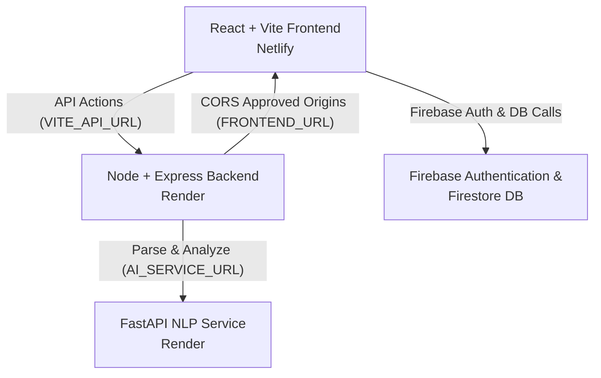

# Hirable Deployment Documentation

This guide describes how to deploy the Hirable project to production environments.

## Architecture Diagram



---

## 1. FastAPI AI/NLP Service Deployment (e.g., Render)

The FastAPI service processes resumes using NLP packages.

- **Hosting Provider**: Render (Web Service) or similar Python-supporting container host
- **Environment/Runtime**: Python 3.10+
- **Build Command**: `pip install -r requirements.txt` (handled automatically by Python platforms when requirements.txt is detected)
- **Start Command**: `uvicorn app:app --host 0.0.0.0 --port $PORT`
- **Environment Variables**:
  - `PORT`: (Set automatically by Render)
- **FastAPI Render Settings**:
  - **Runtime**: `Python`
  - **Build Command**: `pip install -r requirements.txt`
  - **Start Command**: `uvicorn app:app --host 0.0.0.0 --port $PORT`

---

## 2. Node/Express Backend Deployment (e.g., Render)

The Node.js backend coordinates request dispatching and orchestrates calling the FastAPI AI/NLP service.

- **Hosting Provider**: Render (Web Service)
- **Environment/Runtime**: Node.js 18+
- **Root Directory**: `server` (Set Render's Root Directory to `server`)
- **Build Command**: `npm install`
- **Start Command**: `npm start` (runs `node server.js`)
- **Environment Variables**:
  - `PORT`: (Set automatically by Render)
  - `FRONTEND_URL`: `https://your-frontend-app.netlify.app` (URL of the deployed Netlify frontend)
  - `AI_SERVICE_URL`: `https://your-fastapi-service.onrender.com` (URL of the deployed FastAPI service)

---

## 3. Frontend Deployment (Netlify)

The frontend is a React + Vite application.

- **Hosting Provider**: Netlify
- **Root Directory**: Root of repository (`./`)
- **Build Command**: `npm run build`
- **Publish Directory**: `dist`
- **Environment Variables**:
  - `VITE_API_URL`: `https://your-backend-app.onrender.com` (URL of the deployed Express backend)
  - `VITE_FIREBASE_API_KEY`: *(From your Firebase web configuration)*
  - `VITE_FIREBASE_AUTH_DOMAIN`: *(From your Firebase web configuration)*
  - `VITE_FIREBASE_PROJECT_ID`: *(From your Firebase web configuration)*
  - `VITE_FIREBASE_STORAGE_BUCKET`: *(From your Firebase web configuration)*
  - `VITE_FIREBASE_MESSAGING_SENDER_ID`: *(From your Firebase web configuration)*
  - `VITE_FIREBASE_APP_ID`: *(From your Firebase web configuration)*

---

## 4. Local Development Commands

To run the full stack locally:

### 1. Python AI Service
```bash
cd ai-service
# (Optional) Activate virtual environment
venv\Scripts\activate # Windows
source venv/bin/activate # macOS/Linux
# Install packages
pip install -r requirements.txt
# Run service (runs on http://127.0.0.1:8000)
uvicorn app:app --reload
```

### 2. Node/Express Server
```bash
cd server
npm install
# Run server (runs on http://localhost:5000)
npm run dev
```

### 3. React Frontend
```bash
# In workspace root
npm install
# Run development server (runs on http://localhost:5173)
npm run dev
```

---

## 5. Post-Deployment Testing Checklist

Once all three services are deployed, perform the following verification:

1. **Service Health Check**:
   - Access `https://your-backend-app.onrender.com/` in a browser. It should respond with:
     `{"success":true,"message":"Resume Analyzer Backend is Running!"}`
   - Access `https://your-fastapi-service.onrender.com/` in a browser. It should respond with:
     `{"message":"Resume Analyzer Analyzer AI Service is Running!"}`
2. **Frontend Loading**:
   - Visit the Netlify frontend URL. Check the browser console to verify Firebase initialized successfully without warning messages.
3. **User Authentication**:
   - Register or sign in using Google Auth. Verify that the user state updates correctly.
4. **Resume Parsing & Upload**:
   - Upload a sample PDF resume file.
   - Verify the document upload processes without any CORS exceptions in the network console.
5. **Resume Analysis**:
   - Paste a sample job description and execute "Analyze Resume".
   - Confirm that match statistics, skill mappings, recommendations, and parsed text populate properly, and that history records persist to Firestore.
